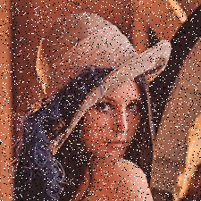
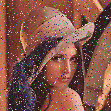
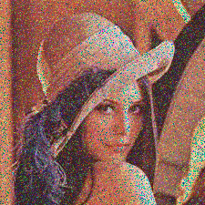
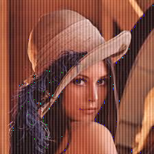
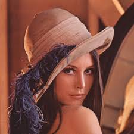

# Genetic-Algorithm-Image-Denoiser

The idea of this investigation is to apply a Genetic Algorithm (GA) to an image, in order to denoise it from digital noise.

This GA is agnostic to any mathematical operation such as __Convolution__ or Processing Images term such as __Kernel__. In anyway, this topic will be covered as a comparision in performance between Genetic Algorithms and the Processing Images approach.

This article will address the following topics:
- The problem of denoising an image.
- Specifics of Genetic Algorithms applied to Image Denoise.
- Implementation.
- Results.

__Summary:__

This is the original Lena image (Well known image in the field of Image Processing) with __Salt & Pepper noise__:



This is how the Genetic Algorithm looks like, when it is applied only in the noisy pixels:


In comparision, this is how looks the denoise process using the __Median Filter Process__:


At first sight, it is visible that the __Median Filter__ blurs the image, while the GA does not. But, the GA does not detects all noisy pixels.

## Image Denoising Problem

There are some theoretical approaches to manipulate images. One of them is related to apply mathematical operations over images, this is known as Image Processing. For sharpening, denoising, introducing noise and analize images, there are a concepts called __kernel__, __convolution__, and statistical concepts such as __mean__, __standard deviation__ and other terms that are required to be able to successfully analize images.

Since some of these operations are related to matrix operations, this always has to do with performance and resources usage.

Regarding the __denoise__ problem, for each sort of noise, there is an algorithm to address its denoise routine. So, the person interested in denoising images should study each problem to be able to apply the corresponding algorithm.

Some of the types of noise are the following:

- Chroma noise:



- Gaussian Noise:



- Periodic Noise:



- Salt & Pepper Noise:


The idea of denoising these images, is to get rid of the pixels that makes the image not fully clear.

## Genetic Algorithm concepts applied to Image Denoising Problem

This section will talk about the concepts of Genetic Algorithms and how they are interpreted in this specific implementation.

1. Individual

For this case, and individual is a pixel already identified as noisy. The way it is determined is by calculating the __Deviation Coefficient__ (__Z__ in statistics terms). How much the pixel is away from the mean? That is the question the algorithm wants to answer before applying the GA over it. Basically, if __|Z| > 2__, then the pixel is considered as noisy.

Refreshing on how the __Deviation Coefficient__ is calculated, and how it is calculated for a RGB pixel:


Assuming we have a Population of pixels __x__:

$$
population = \{x_1, x_2, x_3, ..., x_n\}
$$

First step is to get the mean from the population:

$$
mean = \mu = \frac{\sum_{i=0}^n x_i}{n}
$$

Then, the __Standard Deviation__:

$$
\sigma = \sqrt{\frac{\sum_{i=0}^n \left(x_i - \mu\right)^2}{n}}
$$

Finally, to calculate the __Deviation Coefficient__ of the pixel $x_i$:

$$
Z = \frac{x_i - mean}{\sigma} 
$$

Then, a pixel is noisy if $|Z\left(x_i\right)| > 2$.

2. Gene

For this particular case, a gene of the individual matches with the RGB channel values of a Pixel. The image could seen as a matrix o __MxN__, each cell is considered as a Pixel, and each Pixel is a tuple of $\left(R,G,B\right)$ values for each color channel. So this tuple is the gene.

The shape of the images we are taking for this problem will be in the shape of $\left(M, N, 3\right)$, which __M__ represents the number columns, __N__ the number of rows and 3 is the number of channels of each pixel.

3. Selection

The rules for creating the new population for a certain generation are the following:
    
- The initial population is conformed by the neighborhood of the pixel, which is a matrix of 5x5 pixels around the pixel being evaluated:

$$
\begin{matrix}
0 & 0 & 0 &  0 & 0 \\
0 & 0 & 0 &  0 & 0 \\
0 & 0 & x_i& 0 & 0 \\
0 & 0 & 0 &  0 & 0 \\
0 & 0 & 0 &  0 & 0
\end{matrix}
$$

If the routine is evaluating an edge pixel where some of the initial neighbors are going to be missing, then adding mutant pixels.

- In further generations, the 20% of the best individuals will be bypassed to the next generation.

- Also, the GA will do a crossover between the pixels of the best 50% of the individuals of the last generation, to create the 70% of the next generation.

- And for the last 10%, mutant pixels are going to be added to preserve diversity among the offspring.

4. Crossover operator

Since the genes of each parent are only a tuple of $\left(R,G,B\right)$, then the process of crossing over the genes is the following:

Parent 1:

| $PR_1$ | $PG_1$ | $PB_1$ |
|--------|--------|--------|

Parent 2:

| $PR_2$ | $PG_2$ | $PB_2$ |
|--------|--------|--------|

Where __P__ stands for Parent, and __R__, __G__, __B__ stands for Red, Green and Blue.

How the Algorithm selects and mixes genes from Parent 1 and 2?

Doing a random choice (going deeper in further sections) between Parent 1 and Parent 1 for each channel and determining the child genes. Something like the following pseudocode:

```
FUNC crossover(parent_1, parent 2)
    list child_genes := (0, 0, 0)

    FOR channel_index IN RANGE child_genes:
        list parent_1_list := [True, False]

        boolean is_parent_1 := random_choice(parent_1_list)

        IF is_parent_1 = True THEN
            child_genes[child_index] := parent_1[child_index]
        ELSE
            child_genes[child_index] := parent_2[child_index]
        ENDIF
    ENDFOR

    RETURN child_genes
ENDFUNC
```

5. Mutation operator

This process is the way the GA can preserve diversity over generations. In this case, knowing the images that are taking into consideration are normalized, which means that each Pixel's channel are in the range of $\left[0:256\right[$, then the process of introducing mutants will be doing a random choice in between this range of values for each __RGB__ channel. Something like the following pseudocode:

```
list posible_channel_vals := [0, 1, 2, 3, ..., 255]

FUNC mutant_creator()
    tuple mutant_gene := (0, 0, 0)

    mutant_gene[R_INDEX] := random_choice(posible_channel_vals)
    mutant_gene[G_INDEX] := random_choice(posible_channel_vals)
    mutant_gene[B_INDEX] := random_choice(posible_channel_vals)

    RETURN mutant_gene
ENDFUNC
```


## Results

