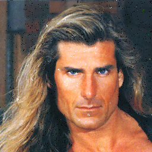

# Genetic-Algorithm-Image-Denoiser

This investigation aims to create an Algorithm capable of learning how to denoise an image. It will be agnostic to any mathematical operations, such as __Convolution__, or the __Kernel__ concept related to the Image Processing field.

This article will address the following topics:
- The problem of denoising an image.
- Specifics of Genetic Algorithms applied to Image Denoise.
- Implementation.
- Results.

__Summary:__

This is the original Lena image (Well known image in the field of Image Processing) with __Salt & Pepper noise__:


This is how the Genetic Algorithm looks like, when it is applied only in the noisy pixels:


In comparision, this is how looks the denoise process using the __Median Filter Process__:


At first sight, it is visible that the __Median Filter__ blurs the image, while the GA does not. But, the GA does not detects all noisy pixels.

## Image Denoising Problem

There are some theoretical approaches to manipulate images. One of them is related to applying mathematical operations over images, which is known as Image Processing. For sharpening, denoising, introducing noise, and analyzing images, there are concepts known as __kernel__ or __convolution__, and statistical concepts such as __mean, standard deviation, etc,__ that are required to be able to successfully analyze images.

Since some of these operations are related to matrix operations, this is always related to performance and resource usage.

Regarding the denoise problem, for each sort of noise, there is an algorithm to address its denoise routine. So, the person interested in denoising images should study each problem to be able to apply the corresponding algorithm.

This approach gets rid of the need to understand how to apply matrix mathematical operations over images and instead lets the routine itself learn this process for you.

Some of the types of noise are the following:

- Chroma noise:


- Gaussian Noise:


- Periodic Noise:


- Salt & Pepper Noise:


The idea of denoising these images, is to get rid of the pixels that makes the image not fully clear.

## Genetic Algorithm concepts applied to Image Denoising Problem

This section will talk about the concepts of Genetic Algorithms and how they are interpreted in this specific implementation.

1. Individual

For this case, an individual is a pixel already identified as noisy. The way it is determined is by calculating the Deviation Coefficient (__Z__ in statistics terms). How far is the pixel away from the mean? That is the question the algorithm wants to answer before applying the GA to it. Basically, if __|Z| > 2__, then the pixel is considered noisy.

Refreshing on how the __Deviation Coefficient__ is calculated, and how it is calculated for a RGB pixel:


Assuming we have a Population of pixels __x__:

$$
population = \{x_1, x_2, x_3, ..., x_n\}
$$

First step is to get the mean from the population:

$$
mean = \mu = \frac{\sum_{i=0}^n x_i}{n}
$$

Then, the __Standard Deviation__:

$$
\sigma = \sqrt{\frac{\sum_{i=0}^n \left(x_i - \mu\right)^2}{n}}
$$

Finally, to calculate the __Deviation Coefficient__ of the pixel $x_i$:

$$
Z = \frac{x_i - mean}{\sigma} 
$$

Then, a pixel is noisy if $|Z\left(x_i\right)| > 2$.

2. Gene

For this particular case, a gene of the individual matches with the RGB channel values of a Pixel. The image could seen as a matrix o __MxN__, each cell is considered as a Pixel, and each Pixel is a tuple of $\left(R,G,B\right)$ values for each color channel. So this tuple is the gene.

The shape of the images we are taking for this problem will be in the shape of $\left(M, N, 3\right)$, where __M__ represents the number columns, __N__ the number of rows and 3 is the number of channels of each pixel.

3. Selection

The rules for creating the new population for a certain generation are the following:
    
- The initial population is composed of the pixel's neighborhood, which is a matrix of 5x5 pixels around the pixel being evaluated:

$$
\begin{matrix}
0 & 0 & 0 &  0 & 0 \\
0 & 0 & 0 &  0 & 0 \\
0 & 0 & x_i& 0 & 0 \\
0 & 0 & 0 &  0 & 0 \\
0 & 0 & 0 &  0 & 0
\end{matrix}
$$

If the routine is evaluating an edge pixel where some of the initial neighbors are going to be missing, then adding mutant pixels.

- In further generations, 20% of the best individuals will be passed to the next generation.

- Also, the GA will crossover the pixels of the best 50% of the individuals of the last generation, to create 70% of the next generation.

- And for the last 10%, mutant pixels are going to be added to preserve diversity among the offspring.

4. Crossover operator

Since the genes of each parent are only a tuple of $\left(R,G,B\right)$, then the process of crossing over the genes is the following:

Parent 1:

| $PR_1$ | $PG_1$ | $PB_1$ |
|--------|--------|--------|

Parent 2:

| $PR_2$ | $PG_2$ | $PB_2$ |
|--------|--------|--------|

Where __P__ stands for Parent, and __R__, __G__, __B__ stands for Red, Green and Blue.

How the Algorithm selects and mixes genes from Parent 1 and 2?

Doing a random choice (going deeper in further sections) between Parent 1 and Parent 1 for each channel and determining the child genes. Something like the following pseudocode:

```
FUNC crossover(parent_1, parent 2)
    list child_genes := (0, 0, 0)

    FOR channel_index IN RANGE child_genes:
        list parent_1_list := [True, False]

        boolean is_parent_1 := random_choice(parent_1_list)

        IF is_parent_1 = True THEN
            child_genes[child_index] := parent_1[child_index]
        ELSE
            child_genes[child_index] := parent_2[child_index]
        ENDIF
    ENDFOR

    RETURN child_genes
ENDFUNC
```

5. Mutation operator

This process is the way the GA can preserve diversity over generations. In this case, knowing the images that are taking into consideration are normalized, which means that each Pixel's channel is in the range of $\left[0:256\right[$, then the process of introducing mutants will be doing a random choice in between this range of values for each __RGB__ channel. Something like the following pseudocode:

```
list posible_channel_vals := [0, 1, 2, 3, ..., 255]

FUNC mutant_creator()
    tuple mutant_gene := (0, 0, 0)

    mutant_gene[R_INDEX] := random_choice(posible_channel_vals)
    mutant_gene[G_INDEX] := random_choice(posible_channel_vals)
    mutant_gene[B_INDEX] := random_choice(posible_channel_vals)

    RETURN mutant_gene
ENDFUNC
```


## Results

Here is the result of denoising the same image with 2 different methods. The first image shows the result of the Genetic Algorithm. To solve this image, it takes around 10 [s]. On the other hand, the __Median Filter__ takes around 1 [s].


In the process of adjusting the Algorithm parameters, it was clear that the direct effect of the mutant genes on the final result. The following 3 images show how the percentage of mutants adds more noise to the final image, so adjust this parameter allows the algorithm to avoid getting stuck at a false minimum, but enough mutants allows the routine to converge to a final fittest individual. 

For this original noised image of a man:


From left to right, the mutant efect is exemplified, being visible that reducing but not getting rid of the mutants helps the GA to converge and provide a better result, the first image is the result of introducing 20% of mutant pixels, the second image introducing 10%, and the third introducing 5%:: 





As it is seen in the last 3 images, fewer randomly colored pixels are shown while introducing fewer mutants. No mutants means that the algorithm will get stuck at a minimum, but not the best solution.

## Conclusions

Seen advantages of the __GA__ over the __Median Filter__:

- Does not blur the image.
- It works for a bunch of sorts of noise, those over the pixels are clearly detected as out of the "normal".
- It is agnostic to any __convolution__ operation, specific __kernel__ filter, or mathematical operation inherent in __Image Processing__. It learns how to denoise an image.
- It applies the process only in the noisy pixels, and not over the entire the image.

Seen disadvantages of the __GA__ over the __Median Filter__:

- Takes 10x more time than the deterministic form of solving the problem.
- It is not deterministic, which means every run will be different, and could take more/less time in each iteration.
- The resources and performance are not known before executing it, could vary depending on the image noise percentage, noise type, random seed, and image size.
- It has more empiric paramters that could be modified to get better results, but is an unknown field that should be studied deeper.
